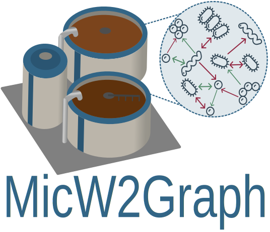
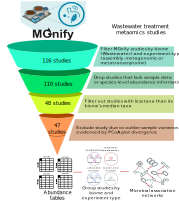

<p align="center">
<figure>
  
</figure>
</p>

<p align="center">
    <a href="https://github.com/Multiomics-Analytics-Group/MicW2Graph/blob/main/LICENSE">
    
    </a>
    <a href="https://zenodo.org/doi/10.5281/zenodo.11394618">
    
    </a>
    <a href="https://micw2graph.streamlit.app/" title="MicW2Graph">
    </a>
</p>

<p align="center">
   Building a knowledge graph of the wastewater treatment microbiome and its biological context
</p>

## Table of contents:
- [About the project](#about-the-project)
- [Data](#data)
- [Exploratory data analysis](#exploratory-data-analysis)
- [Microbial associarion networks](#microbial-association-networks)
- [MicW2Graph](#micw2graph)
- [Case studies](#case-studies)
- [How to run the web app locally?](#how-to-run-the-web-app-locally)
- [Credits and acknowledgements](#credits-and-acknowledgements)
- [Citation](#citation)
- [Contact and feedback](#contact-and-feedback)

## About the project

**Wastewater treatment (WWT)** is the process of removing contaminants from used water before it is discharged back into the environment, which contributes to address water scarcity and to protect aquatic ecosystems. Recent advances in high-throughput omics technologies have facilitated the study of **microbiomes** from complex environmental samples such as WWT. A comprehensive study of an environmental microbiome requires integrating data from various studies and **meta-omics** technologies, as well as biological knowledge to interpret these data.

In this project, we investigated the microbiome of the WWT process to build **MicW2Graph**, an open-source **knowledge graph** that integrates **metagenomic and metatranscriptomic** information with their **biological context**, including biological processes, environmental and phenotypic features, chemical compounds, and additional metadata. 

We developed a workflow to collect meta-omics datasets from [MGnify][Mgnify] and infer potential interactions among microorganisms through **microbial association networks (MANs)**. MicW2Graph enables the investigation of research questions related to WWT, focusing on aspects such as microbial connections, community memberships, and potential ecological functions.

The following figure shows the general workflow of the MicW2Graph project:
<p align="center">
<figure>
  
</figure>
</p>

## Data

WWT meta-omics studies were queried from the **MGnify API** using experiment type and biome parameters. Further filters were applied based on experimental and taxonomic criteria. The abundance tables from the filtered studies were then grouped by **biome** and **experiment type** to infer **MANs**. 

The workflow for retrieving and filtering WWT meta-omics studies from MGnify is summarized in the diagram below:
<p align="center">
<figure>
  
</figure>
</p>

The code to retrieve the data from MGnify is available in this [GitHub repository][retrieve_info_mgnify].

## Exploratory data analysis

A general overview of the filtered studies was provided through various plots, describing the number of studies and samples, experiment types, sampling countries, sub-biomes, and other relevant metadata.

The exploratory data analysis was encapsulated in a **module of the MicW2Graph web application**, containing a **general overview of all studies**, **studies by sub-biomes**, **individual studies**, and a section for conducting **pairwise comparisons between studies**.

<p align="center">
<figure>
  
</figure>
</p>

## Microbial association networks (MANs)
> [!TIP]
> The MANs for this study are available for download and visualization in the MicW2Graph web application.

MANs are **weighted and undirected networks**, defined as *G = (V, E)*, where *V* is a set of nodes and *E* is a set of edges. Nodes in these networks are Operational Taxonomic Units at a specific taxonomic level, while **edges indicate substantial co-presence (positive interaction) or mutual exclusion (negative interaction) trends** in microorganism abundances across samples. 

**Weights** in MANs correspond to association values among species defined by the inference method, and there is an edge between two nodes if this number is greater than or equal to a given cutoff *t*. 

In this project, we selected the [Correlation inference for Compositional data through Lasso (CCLasso)][CCLasso] method. Network inference was conducted using the [NetCoMi][NetCoMi] R package. 

<p align="center">
<figure>
  
</figure>
</p>

The code for the network inference and analysis of MANs is available in this [GitHub repository][net_inf_analysis].

## MicW2Graph
> [!TIP]
> The KG and sub-biome subgraphs are available for download and visualization in the MicW2Graph web application.

MicW2Graph incorporates the **MANs with the optimal association threshold for each WWT sub-biome and experiment type**, the **biological context** of the species within the MANs, and **ontologies** that standardize and expand the information of this resource. 

> [!NOTE]
> This KG comprises **1247 nodes and 9749 relationships**, categorized into 12 node labels and 8 relationship labels. The relationships in MicW2Graph are classified as taxonomic, functional, and data-driven, reflecting the different layers of knowledge available in the KG.

The MicW2Graph **metagraph** and a snapshot of the graph database with nodes and edges for all sub-biomes and experiment types are shown below:
<p align="center">
<figure>
  
</figure>
</p>

<p align="center">
<figure>
  
</figure>
</p>

## Case studies
> [!TIP]
> The subgraphs for the case studies can be visualized and downloaded in the MicW2Graph web application.

The use cases demonstrate the **potential of MicW2Graph to discover new species associated with WWT biological processes**, showing how the available information of well-known species can help to predict potential functions and traits for less studied species. These species and communities can be further investigated as potential candidates to optimize the bioremediation process. 

<p align="center">
<figure>
  
</figure>
</p>

## How to run the web app locally?

[UV][uv] was used to create a **Python virtual environment**, which allows the management of python libraries and their dependencies. Each **UV** virtual environment has a `pyproject.toml` file with the names and versions of libraries installed, and a `UV.lock` file, a JSON file that contains versions of libraries and their dependencies.

To create a Python virtual environment with libraries and dependencies required for this project, you should [install UV][install-uv], clone this GitHub repository, open a terminal, move to the folder containing this repository, and run the following command:

```bash
$ uv sync
```

You can find a detailed guide on how to use UV [here][UV-docs].

Alternatively, you can create a conda virtual environment with the required libraries using the `requirements.txt` file.

After installing the virtual environment, you can run the streamlit app locally with the command below if you are using UV:

```bash
$ uv run streamlit run MicW2Graph_Home.py
```

Or just remove the `uv run` part if you are using conda or another virtual environment manager.

## Credits and acknowledgements

- Developed by [Sebastián Ayala Ruano][myweb] under the supervision of [Alberto Santos][Alberto], head of the [Multiomics Network Analytics Group (MoNA)][Mona] at the [Novo Nordisk Foundation Center for Biosustainability (DTU Biosustain)][Biosustain].
- MicW2Graph was built for the thesis project from the [MSc in Systems Biology][sysbio] at the MoNA group.
- The data for this project was obtained from [Mgnify][Mgnify], using the scripts available in this [GitHub repository][retrieve_info_mgnify].

## Citation

If you use MicW2Graph in your research or publications, please cite the project as follows:

### APA

Ayala-Ruano, S., Luu Phanthanourak, A., Reverenna, M., Palleja Caro, A., & Santos, A. (2024). **MicW2Graph: Building a knowledge graph of the wastewater treatment microbiome and its biological context** (Version 1.0.0) [Software]. Zenodo. **https://doi.org/10.5281/zenodo.11394618**

### BibTeX

```bibtex
@software{Ayala-Ruano_MicW2Graph_2024,
  author = {Ayala-Ruano, Sebastian and Luu Phanthanourak, Angel and Reverenna, Marco and Palleja Caro, Albert and Santos, Alberto},
  doi = {10.5281/zenodo.11394618},
  month = {may},
  title = {{MicW2Graph: Building a knowledge graph of the wastewater treatment microbiome and its biological context}},
  url = {https://github.com/Multiomics-Analytics-Group/MicW2Graph},
  version = {1.0.0},
  year = {2024},
  keywords = {knowledge graph, wastewater, microbiome, bioinformatics, data science, environmental science}
}
```

## Contact and feedback

We appreciate your feedback! If you have any comments, suggestions, or run into issues while using MicW2Graph, feel free to [open an issue][new-issue] in this repository. Your input helps us make this project better for everyone.

[CCLasso]: https://github.com/huayingfang/CCLasso
[NetCoMi]: https://github.com/stefpeschel/NetCoMi
[net_inf_analysis]: https://github.com/Multiomics-Analytics-Group/Microbial_network_inference_and_analysis_MicW2Graph
[uv]: https://github.com/astral-sh/uv
[install-uv]: https://docs.astral.sh/uv/getting-started/installation/
[UV-docs]: https://docs.astral.sh/uv/
[sysbio]: https://www.maastrichtuniversity.nl/education/master/systems-biology
[myweb]: https://sayalaruano.github.io/
[Alberto]: https://orbit.dtu.dk/en/persons/alberto-santos-delgado
[Mona]: https://multiomics-analytics-group.github.io/
[Biosustain]: https://www.biosustain.dtu.dk/
[retrieve_info_mgnify]: https://github.com/Multiomics-Analytics-Group/Retrieve_info_MGnifyAPI
[Mgnify]: https://www.ebi.ac.uk/metagenomics/api/latest/
[new-issue]: https://github.com/Multiomics-Analytics-Group/MicW2Graph/issues/new
